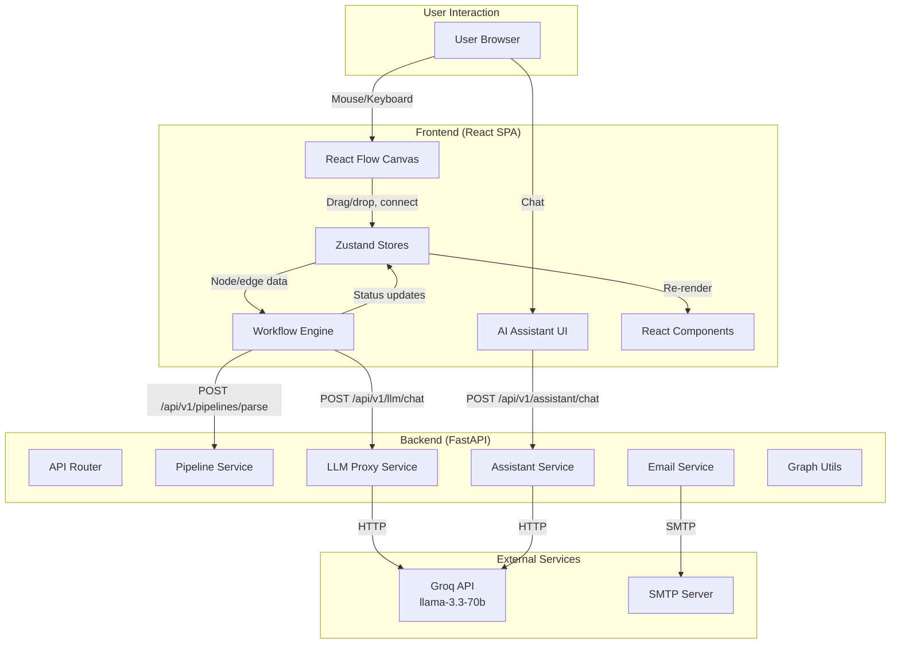
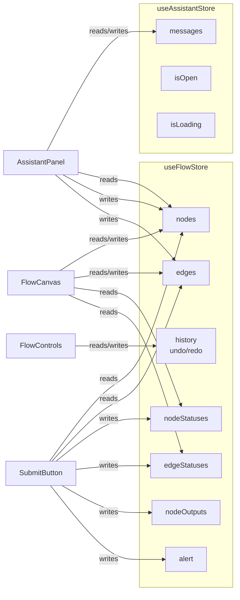
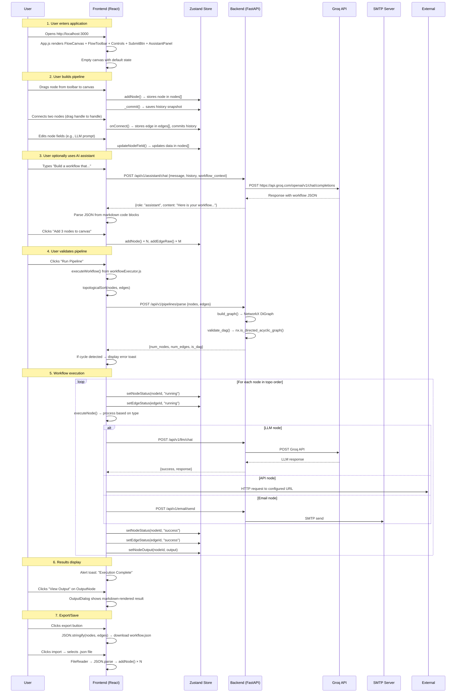
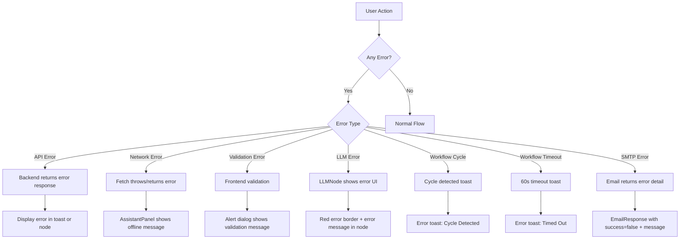
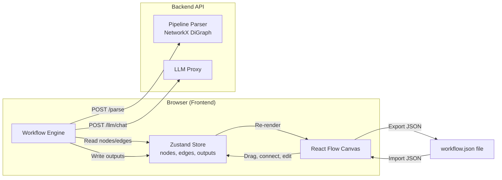
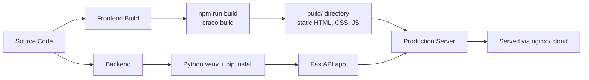

# Pipeline Builder

## Executive Summary

Pipeline Builder is a full-stack visual workflow automation application that allows users to design, validate, and execute Directed Acyclic Graph (DAG)-based pipelines through a drag-and-drop interface. It combines an interactive node-based canvas with an AI-powered workflow assistant to help users build automation flows without writing code.

**Business Purpose**: Enable non-technical and technical users alike to create automated data processing pipelines, AI-powered workflows, and integration chains using a visual builder — reducing development time from days to minutes.

**Target Users**: Developers, data engineers, automation specialists, and power users who need to compose multi-step workflows involving LLM calls, API requests, conditionals, delays, database operations, and notifications.

**Core Value Proposition**: 
- Visual pipeline construction with zero code required
- Built-in AI assistant (Groq-backed) that generates workflows from natural language
- Client-side workflow execution engine with topological sort
- DAG validation ensuring pipeline correctness
- Undo/redo history, import/export, and real-time execution visualization

**Main Features**:
- Drag-and-drop node-based pipeline editor (React Flow)
- 9 node types: Input, Output, Text, LLM, API Request, Condition, Delay, Database, Notification
- AI Workflow Assistant (chat interface, Groq API integration)
- Pipeline DAG validation via backend API
- Client-side workflow execution engine (topological sort + sequential execution)
- Undo/Redo history (up to 50 states)
- Workflow import/export as JSON
- Keyboard shortcuts (Ctrl+Z, Ctrl+Shift+Z, Ctrl+Y)
- Variable templating in Text nodes (`{{variable}}`)
- Markdown rendering for output display
- Edge context menu (delete connections)
- SMTP email sending endpoint
- LLM proxy endpoint (Groq API)
- Visual execution feedback (node/edge status colors, animations)

---

# High Level Architecture

## Overview

The application follows a two-tier architecture: a React single-page application (SPA) frontend communicating with a Python FastAPI backend via RESTful HTTP APIs. There is no database — all state is maintained in-memory on the frontend (via Zustand) and the backend is stateless, processing requests on-demand.



## Frontend Architecture

The frontend is a Create React App (CRA) with CRACO overrides for Tailwind CSS. It uses `@xyflow/react` (React Flow v12) for the node-based canvas, Zustand for state management, and Tailwind CSS for styling.

**Component Tree:**
```
App
├── FlowCanvas (React Flow instance)
│   ├── Custom Nodes (InputNode, OutputNode, TextNode, LLMNode, ConditionNode, DelayNode)
│   ├── Generated Nodes (api, database, notification via createNode factory)
│   ├── EdgeContextMenu (right-click on edges)
│   ├── Controls (zoom, fit view)
│   ├── MiniMap
│   └── Background (dots)
├── FlowToolbar (sidebar node palette)
│   └── DraggableNode (individual palette items)
├── FlowControls (undo/redo/import/export/clear)
├── SubmitButton (run pipeline + alert toast)
└── AssistantPanel (AI chat)
    └── AssistantMessage (individual chat messages)
```

**Key design decisions:**
- Two node creation patterns: custom components for complex nodes (Input, Output, Text, LLM, Condition, Delay) and a `createNode` factory for simpler nodes (API, Database, Notification)
- Node types registered in `nodeTypes` map in `frontend/src/components/nodes/index.js`
- No routing library — single-page, single-view application
- No external authentication — the app is self-contained

## Backend Architecture

The backend uses FastAPI with a factory pattern (`create_app()`). It is organized into layers: routes, services, schemas, models, core, and utils.

**Layer structure:**
```
backend/app/
├── main.py              # App factory, CORS, exception handlers
├── api/                 # Route definitions (thin controllers)
│   ├── router.py        # Aggregates all sub-routers
│   └── routes/          # Individual endpoint modules
├── core/                # Configuration, logging, exceptions
├── models/              # Internal data models (Node, Edge)
├── schemas/             # Pydantic request/response schemas
├── services/            # Business logic layer
└── utils/               # Graph utilities (NetworkX)
```

**Key design decisions:**
- Stateless backend — no database, no sessions
- Singleton service pattern (module-level instances like `pipeline_service`)
- Custom exception hierarchy: `PipelineError` → `GraphValidationError`, `MalformedPipelineError`
- Loguru for logging (stdout + daily rotating files, 7-day retention)

## Database Architecture

**No database is used.** All application state lives in the browser (Zustand stores). The backend is purely stateless and processes requests without persisting any data. Workflows can be exported/imported as JSON files from the frontend.

## Authentication Architecture

**No authentication is implemented.** The backend has CORS configured with `allow_origins=["*"]` (wide open). There are no auth middleware, JWT handling, session management, or API key checks on any endpoint. The Groq API key is stored in the backend `.env` file and used server-side only.

## API Architecture

All API endpoints are prefixed with `/api/v1` (configurable via `API_PREFIX` env var) and use RESTful JSON conventions.

**Endpoint summary:**

| Method | Route | Purpose |
|--------|-------|---------|
| GET | `/health` | Health check |
| POST | `/api/v1/pipelines/parse` | Validate pipeline DAG |
| POST | `/api/v1/assistant/chat` | AI workflow assistant |
| POST | `/api/v1/llm/chat` | LLM proxy (Groq) |
| POST | `/api/v1/email/send` | Send email via SMTP |

## State Management Architecture

State is managed exclusively on the frontend using two Zustand stores:



**Data flow for execution:**
1. User clicks "Run Pipeline"
2. `SubmitButton` reads `nodes` and `edges` from `useFlowStore`
3. Calls `executeWorkflow()` from `workflowExecutor.js`
4. Engine does topological sort, then iterates nodes sequentially
5. Each node sets `nodeStatus` to "running", executes, then sets "success"/"error"
6. Edge statuses updated in parallel
7. Outputs stored in `nodeOutputs`
8. Alert toast displayed on completion/error

## External Integrations

**1. Groq API** (via `llama-3.3-70b-versatile`)
- Used by: `LLMNode` (frontend), `assistant_service.py` (backend), `llm.py` route (backend)
- No other AI providers are configured

**2. SMTP** (generic, configurable per request)
- Used by: `email.py` route
- Credentials provided in the request body (not pre-configured)

**3. NetworkX** (Python graph library)
- Used by: `graph.py` utility for DAG validation
- No other graph analysis libraries

---

# Technology Stack

| Layer | Technology | Purpose |
|-------|-----------|---------|
| Frontend Framework | React 18 | UI component library and rendering |
| Flow Canvas | @xyflow/react (React Flow v12) | Interactive node-based graph editor |
| State Management | Zustand 5 | Lightweight global state management |
| Styling | Tailwind CSS 3 | Utility-first CSS framework for rapid styling |
| Build Tool | CRACO 7 | CRA configuration override (PostCSS/Tailwind) |
| Icons | Lucide React | Consistent icon set for UI |
| Dialog | Radix UI Alert Dialog | Accessible modal dialogs |
| HTTP Client | Axios (installed), Fetch API (actually used) | API communication |
| CSS Utilities | clsx + tailwind-merge + class-variance-authority | Conditional class merging |
| Backend Framework | FastAPI 0.110+ | High-performance Python async web framework |
| ASGI Server | Uvicorn 0.27+ | Python ASGI server |
| Data Validation | Pydantic v2 | Request/response schema validation |
| Graph Analysis | NetworkX 3+ | DAG validation and graph statistics |
| Logging | Loguru 0.7+ | Structured logging with rotation |
| HTTP Client | httpx 0.27+ | Async HTTP requests for LLM/assistant proxying |
| Settings | Pydantic Settings | Environment variable loading and validation |
| AI Provider | Groq API (llama-3.3-70b-versatile) | LLM inference for assistant and LLM node |
| Monorepo Orchestration | concurrently | Runs frontend and backend in parallel |
| SMTP | Python smtplib (stdlib) | Email sending |

## Technology Rationale

- **React Flow** was chosen because it provides a fully-featured, customizable node-based canvas with built-in handling of drag-and-drop, connections, zoom/pan, minimap, and edge routing — eliminating months of custom canvas work.
- **Zustand** over Redux because the state is relatively simple (nodes, edges, history) and Zustand provides a minimal API with no boilerplate, direct store access outside components, and excellent TypeScript support.
- **FastAPI** was chosen for its async capabilities, automatic OpenAPI documentation, Pydantic integration, and excellent performance characteristics.
- **NetworkX** provides robust, battle-tested graph algorithms (DAG detection) without needing to implement custom graph traversal.
- **Loguru** simplifies Python logging significantly compared to the standard `logging` module, with built-in rotation, formatting, and colored output.
- **CRACO** was needed because CRA 5 does not natively support PostCSS configuration, which is required for Tailwind CSS.
- **Groq** was chosen for its fast inference speeds and generous free tier.

---

# Complete Folder Structure

```
yc/
├── package.json                          # Monorepo root: orchestration scripts
├── package-lock.json                     # Root npm lockfile
├── node_modules/                         # Root npm dependencies (concurrently)
│
├── backend/                              # Python FastAPI backend
│   ├── .env                              # Environment variables (API key, config)
│   ├── requirements.txt                  # Python dependencies
│   ├── main.py                           # Legacy entry point (unused, basic stub)
│   │
│   ├── app/                              # Main application package
│   │   ├── __init__.py                   # Empty package marker
│   │   ├── main.py                       # App factory (create_app), CORS, exception handlers
│   │   │
│   │   ├── api/                          # API routing layer
│   │   │   ├── __init__.py               # Empty package marker
│   │   │   ├── router.py                 # Master router aggregating sub-routers
│   │   │   │
│   │   │   └── routes/                   # Route modules (thin controllers)
│   │   │       ├── __init__.py           # Empty package marker
│   │   │       ├── assistant.py          # POST /api/v1/assistant/chat
│   │   │       ├── email.py              # POST /api/v1/email/send
│   │   │       ├── llm.py                # POST /api/v1/llm/chat
│   │   │       └── pipeline.py           # POST /api/v1/pipelines/parse
│   │   │
│   │   ├── core/                         # Core configuration and utilities
│   │   │   ├── __init__.py               # Empty package marker
│   │   │   ├── config.py                 # Pydantic Settings class (.env loading)
│   │   │   ├── exceptions.py             # Custom exception hierarchy + handler
│   │   │   └── logging.py                # Loguru configuration (stdout + file)
│   │   │
│   │   ├── models/                       # Internal data models
│   │   │   ├── __init__.py               # Empty package marker
│   │   │   └── pipeline.py               # Node and Edge Pydantic models
│   │   │
│   │   ├── schemas/                      # Request/Response Pydantic schemas
│   │   │   ├── __init__.py               # Empty package marker
│   │   │   └── pipeline.py               # PipelineRequest, PipelineResponse, NodeSchema, EdgeSchema
│   │   │
│   │   ├── services/                     # Business logic layer
│   │   │   ├── __init__.py               # Empty package marker
│   │   │   ├── assistant_service.py      # AI assistant chat (Groq API)
│   │   │   └── pipeline_service.py       # Pipeline parsing and DAG validation
│   │   │
│   │   └── utils/                        # Utility modules
│   │       ├── __init__.py               # Empty package marker
│   │       └── graph.py                  # NetworkX graph building and DAG validation
│   │
│   └── logs/                             # Rotating log files (auto-created)
│       ├── pipeline_2026-05-29.log
│       └── pipeline_2026-05-30.log
│
├── frontend/                             # React frontend
│   ├── package.json                      # npm dependencies and scripts
│   ├── package-lock.json                 # npm lockfile
│   ├── craco.config.js                   # CRACO config (PostCSS/Tailwind)
│   ├── postcss.config.js                 # PostCSS plugins config
│   ├── tailwind.config.js                # Tailwind theme (colors, fonts, animations)
│   ├── .gitignore                        # Frontend git ignore
│   │
│   ├── public/                           # Static assets (served as-is)
│   │   ├── index.html                    # HTML template
│   │   ├── favicon.ico                   # Browser tab icon
│   │   ├── logo192.png                   # PWA icon 192x192
│   │   ├── logo512.png                   # PWA icon 512x512
│   │   ├── manifest.json                 # PWA manifest
│   │   └── robots.txt                    # Crawler rules
│   │
│   ├── build/                            # Production build output (generated)
│   │   ├── index.html
│   │   ├── favicon.ico
│   │   ├── logo192.png
│   │   ├── logo512.png
│   │   ├── manifest.json
│   │   ├── robots.txt
│   │   ├── asset-manifest.json
│   │   └── static/
│   │       ├── css/
│   │       │   ├── main.[hash].css
│   │       │   └── main.[hash].css.map
│   │       └── js/
│   │           ├── main.[hash].js
│   │           ├── main.[hash].js.LICENSE.txt
│   │           └── main.[hash].js.map
│   │
│   └── src/                              # Application source code
│       ├── index.js                      # React entry point
│       ├── index.css                     # Global styles (1350 lines of CSS)
│       ├── App.js                        # Root component + keyboard shortcuts
│       │
│       ├── components/                   # UI components
│       │   ├── assistant/
│       │   │   └── AssistantPanel.jsx    # AI chat panel (274 lines)
│       │   │
│       │   ├── flow/                     # Flow canvas components
│       │   │   ├── DraggableNode.jsx     # Draggable palette item
│       │   │   ├── EdgeContextMenu.jsx   # Right-click edge menu
│       │   │   ├── FlowCanvas.jsx        # React Flow canvas (main workspace)
│       │   │   ├── FlowControls.jsx      # Undo/Redo/Import/Export/Clear
│       │   │   ├── FlowToolbar.jsx       # Sidebar node palette with search
│       │   │   └── SubmitButton.jsx      # Run pipeline + toast alerts
│       │   │
│       │   ├── nodes/                    # Custom node types
│       │   │   ├── index.js              # nodeTypes registry map
│       │   │   ├── BaseNode.jsx          # Shared node shell (handles, header, status)
│       │   │   │
│       │   │   ├── registry/             # Node configuration and factory
│       │   │   │   ├── createNode.jsx    # Generic node factory function
│       │   │   │   ├── nodeConfigurations.js # Node configs for api/condition/delay/db/notification
│       │   │   │   └── nodeRegistry.js   # Node type registry + category definitions
│       │   │   │
│       │   │   └── types/               # Individual node implementations
│       │   │       ├── ConditionNode.jsx  # Condition/branch node
│       │   │       ├── DelayNode.jsx      # Delay node
│       │   │       ├── InputNode.jsx      # Input node
│       │   │       ├── LLMNode.jsx        # LLM node (Groq API)
│       │   │       ├── OutputNode.jsx     # Output node (markdown rendering)
│       │   │       └── TextNode.jsx       # Text template node
│       │   │
│       │   └── ui/                       # UI primitives
│       │       └── alert-dialog.jsx      # Radix UI Alert Dialog wrapper
│       │
│       ├── hooks/                        # Custom React hooks
│       │   └── useAutoResizeTextarea.js  # Auto-resizing textarea hook
│       │
│       ├── lib/                          # Utility libraries
│       │   ├── api.js                    # API client (parsePipeline)
│       │   ├── flowHelpers.js            # React Flow default options
│       │   ├── parseVariables.js         # Template variable parsing
│       │   ├── utils.js                  # cn() helper, node ID generation, handle colors
│       │   └── workflowExecutor.js       # Topological sort + execution engine
│       │
│       ├── store/                        # Zustand state stores
│       │   ├── useAssistantStore.js      # Assistant panel state
│       │   └── useFlowStore.js           # Flow state (nodes, edges, history, execution)
│       │
│       └── styles/
│           └── reactflow.css             # React Flow style overrides
│
└── docs/                                 # Documentation files
    └── init.md                           # ShadCN init instructions
```

## Folder Responsibilities

| Folder | Responsibility | Why It Exists |
|--------|---------------|---------------|
| `backend/` | Python FastAPI server | Provides API endpoints for pipeline validation, LLM proxy, assistant chat, and email |
| `backend/app/` | Application package | Main application code (not a single-file script) |
| `backend/app/api/` | API routing layer | Separates HTTP concerns from business logic |
| `backend/app/api/routes/` | Endpoint handlers | Thin controllers that validate input and delegate to services |
| `backend/app/core/` | Cross-cutting concerns | Configuration, logging, and exception handling shared across modules |
| `backend/app/models/` | Internal data models | Core domain objects (Node, Edge) used by services and utils |
| `backend/app/schemas/` | API data contracts | Request/response schemas with validation rules |
| `backend/app/services/` | Business logic | Orchestration of operations, calling utils and external APIs |
| `backend/app/utils/` | Pure utility functions | Graph algorithms with no business logic |
| `backend/logs/` | Log output | Auto-created by Loguru; contains rotating log files |
| `frontend/` | React SPA | Client-side application with visual workflow builder |
| `frontend/public/` | Static assets | Files served without processing (favicon, manifest, template HTML) |
| `frontend/src/` | Application source | React components, hooks, stores, utilities |
| `frontend/src/components/flow/` | Canvas infrastructure | React Flow wrapper, toolbar, controls, submit button |
| `frontend/src/components/nodes/` | Node implementations | All custom node types and the node factory |
| `frontend/src/components/nodes/registry/` | Node configuration | Central definitions for node types, categories, and field configs |
| `frontend/src/components/nodes/types/` | Complex nodes | Nodes with custom UI beyond the factory pattern |
| `frontend/src/components/assistant/` | AI assistant | Chat panel with workflow generation |
| `frontend/src/components/ui/` | UI primitives | Reusable low-level UI components (AlertDialog) |
| `frontend/src/store/` | State management | Zustand stores for flow state and assistant state |
| `frontend/src/lib/` | Utilities | API client, helpers, execution engine |
| `frontend/src/hooks/` | Custom hooks | Reusable React hooks |
| `frontend/src/styles/` | Style overrides | CSS overrides for third-party libraries |
| `frontend/build/` | Production output | Generated by `npm run build`; contains deployable assets |
| `docs/` | Documentation | Project documentation files |

---

# Application Flow

## Step-by-Step User Journey



## Error Handling Flow



---

# Frontend Walkthrough

## Pages

The application is a **single-page application** with no routing. All functionality exists on one screen divided into logical areas:

1. **Flow Canvas** (center) — the main workspace
2. **Component Toolbar** (left sidebar) — draggable node palette
3. **Controls Panel** (top-right) — undo/redo/import/export/clear
4. **Run Button** (top-center) — execute pipeline
5. **Assistant Panel** (right, toggleable) — AI chat

## Main Components

### App.js
**File**: `frontend/src/App.js`

**Purpose**: Root component. Composes all major sections and registers global keyboard shortcuts (Ctrl+Z undo, Ctrl+Shift+Z/Ctrl+Y redo).

**Props**: None (root component).

**Internal Logic**: Sets up a `useEffect` that listens to `keydown` events. Calls `undo()` / `redo()` from `useFlowStore` based on modifier keys. Cleans up listener on unmount.

**Data Flow**: Renders children in an absolute-positioned container (`width: 100vw, height: 100vh, position: relative`). No prop drilling — all children access Zustand stores directly.

---

### FlowCanvas.jsx
**File**: `frontend/src/components/flow/FlowCanvas.jsx`

**Purpose**: Wraps the `@xyflow/react` component. Serves as the main interactive canvas for building and editing pipelines.

**Props**: None. Reads from `useFlowStore`.

**Internal Logic**:
- Manages a `rfInstance` ref to access React Flow API (for `screenToFlowPosition`)
- `onDrop`: reads `application/reactflow` data transfer, parses node type, computes flow position, calls `addNode`
- `onDragOver`: prevents default to allow drops
- `onEdgeContextMenu`: positions a context menu at mouse coordinates
- Maps edges with status-based styling (running/success/error colors, animated dashes)
- Passes `nodeTypes` from `components/nodes/index.js`

**Data Flow**: Reads `nodes`, `edges`, `edgeStatuses` from `useFlowStore`. Writes via `onNodesChange`, `onEdgesChange`, `onConnect`, `addNode`.

**Key Configuration**:
- `snapToGrid: true`, `snapGrid: [20, 20]`
- `connectionLineType: "smoothstep"`
- `deleteKeyCode: ["Backspace", "Delete"]`
- `minZoom: 0.3`, `maxZoom: 2`
- Background: dots, gap 20, color `#D1CEC5`
- MiniMap: positioned top-right, custom node colors
- Edge context menu (right-click)

---

### FlowToolbar.jsx
**File**: `frontend/src/components/flow/FlowToolbar.jsx`

**Purpose**: Left sidebar showing categorized, searchable node palette.

**Internal Logic**:
- Reads `nodeRegistry` and `nodeCategories` from `nodeRegistry.js`
- Filters nodes based on search input (matches label or description)
- Groups filtered nodes by category
- Supports collapsing/expanding categories
- Supports collapsing the entire toolbar to a minimized state

**Data Flow**: No direct store access. Passes `type`, `label`, `icon`, `description` to each `DraggableNode`.

---

### DraggableNode.jsx
**File**: `frontend/src/components/flow/DraggableNode.jsx`

**Purpose**: Individual item in the toolbar palette. Initiates HTML5 drag-and-drop.

**Props**:
- `type`: string (e.g., "customInput", "llm")
- `label`: string (display name)
- `icon`: Lucide icon component
- `description`: string

**Internal Logic**: `onDragStart` sets `application/reactflow` data with `{nodeType}`. Canvas's `onDrop` reads this data.

---

### FlowControls.jsx
**File**: `frontend/src/components/flow/FlowControls.jsx`

**Purpose**: Action buttons for workflow management.

**Actions**:
1. **Undo** (Ctrl+Z) — restores previous history state
2. **Redo** (Ctrl+Y) — restores next history state
3. **Import** — opens file picker, reads JSON, replaces canvas content
4. **Export** — serializes nodes/edges to JSON, triggers download
5. **Clear** — double-click confirmation, then calls `clearWorkflow()`

**Data Flow**: Reads `historyIndex`, `history` from `useFlowStore`. Writes via `undo()`, `redo()`, `clearWorkflow()`.

---

### SubmitButton.jsx
**File**: `frontend/src/components/flow/SubmitButton.jsx`

**Purpose**: Executes the pipeline and displays alert toasts.

**Internal Logic**:
- Reads node/edge data from store
- Validates at least one node exists
- Calls `clearNodeStatuses()` to reset execution state
- Calls `executeWorkflow(nodes, edges, callbacks)`
- Toggles loading state during execution

**AlertToast sub-component**: Positioned absolutely above the button. Auto-dismisses after 5 seconds. Four types: success, error, warning, info. Each has corresponding icon and border color.

---

### EdgeContextMenu.jsx
**File**: `frontend/src/components/flow/EdgeContextMenu.jsx`

**Purpose**: Right-click context menu on edges allowing deletion.

**Props**: `edgeId`, `position: {x, y}`, `onClose`.

**Internal Logic**: Registers global mousedown listener to close on outside click. Escape key closes. Delete action calls `onEdgesChange([{ id: edgeId, type: "remove" }])`.

---

### AssistantPanel.jsx
**File**: `frontend/src/components/assistant/AssistantPanel.jsx`

**Purpose**: AI-powered chat assistant that helps users build workflows.

**Internal Logic**:
- FAB (floating action button) toggles panel open/closed
- Chat messages rendered with `AssistantMessage` sub-component
- Parses workflow JSON from assistant's markdown code blocks
- "Add X nodes to canvas" buttons added to assistant messages containing workflow JSON
- `handleAddWorkflow`: maps AI-generated node IDs to store IDs, creates nodes and edges
- `mapType()`: fuzzy-matches node type names from AI text to known types
- `HANDLE_OUTPUT`/`HANDLE_INPUT`: maps node types to their handle IDs for edge creation

**AssistantMessage sub-component**:
- Renders user vs AI messages with different styling
- Highlights known node names in text
- Renders code blocks in `pre` with copy buttons
- Shows workflow action buttons

---

## Node Components

### BaseNode.jsx
**File**: `frontend/src/components/nodes/BaseNode.jsx`

**Purpose**: Shared shell for all node types. Provides consistent header, body, handles, and execution status styling.

**Props**:
- `id`: string (node identifier)
- `title`: string (display name)
- `icon`: Lucide icon component
- `children`: React nodes (field content)
- `inputs`: array of `{id: string}` (target handles)
- `outputs`: array of `{id: string}` (source handles)
- `className`: optional extra CSS class

**Internal Logic**:
- Reads `selectedNode` from store to apply selected styling
- Reads `nodeStatuses[id]` for execution state
- Status classes: `exec-running` (blue glow + spinner), `exec-success` (green glow), `exec-error` (red glow)
- Handles positioned at percentages based on count
- `getHandleColor()`: assigns CSS class based on handle ID suffix

---

### InputNode.jsx
**File**: `frontend/src/components/nodes/types/InputNode.jsx`

**Purpose**: Source node — provides input data to the pipeline.

**Fields**: `inputName` (text), `inputValue` (textarea).

**Handles**: 1 output (`{id}-value`).

**Store Dependencies**: `updateNodeField`.

---

### OutputNode.jsx
**File**: `frontend/src/components/nodes/types/OutputNode.jsx`

**Purpose**: Sink node — displays pipeline execution results.

**Fields**: `outputName` (text).

**Handles**: 1 input (`{id}-value`).

**Internal Logic**:
- Reads `nodeOutputs[id]` from store
- "View Output" button opens `OutputDialog`
- `OutputDialog`: draggable, resizable, renders markdown
- `mdToHtml()`: custom markdown-to-HTML converter (headings, bold, italic, code, links, lists, strikethrough)

---

### TextNode.jsx
**File**: `frontend/src/components/nodes/types/TextNode.jsx`

**Purpose**: Template node with variable interpolation.

**Fields**: `text` (textarea, auto-resizing).

**Handles**: Dynamic inputs per `{{variable}}` detected in text, 1 output (`{id}-output`).

**Internal Logic**:
- Uses `parseVariables()` from `parseVariables.js` to extract `{{variable}}` patterns
- Creates input handles dynamically for each unique variable
- Auto-resizes textarea via `useEffect`
- "Preview Output" button: replaces `{{variable}}` with test values
- Displays variable badges and test value input fields

---

### LLMNode.jsx
**File**: `frontend/src/components/nodes/types/LLMNode.jsx`

**Purpose**: AI node — calls Groq API for LLM inference.

**Fields**: `apiKey` (password toggle), `model` (select: Llama 3.3 70B, Llama 3.1 8B, Mixtral 8x7B, Gemma 2 9B), `systemPrompt` (textarea), `prompt` (textarea).

**Handles**: 2 inputs (`{id}-system`, `{id}-prompt`), 1 output (`{id}-response`).

**Internal Logic**:
- Has incoming connection detection: if connected, `connectedValue` is derived from source node's output
- If no prompt text but incoming connection exists, auto-uses connected input as prompt
- "Run LLM" button: fetches directly from Groq API (if `apiKey` provided) or proxies through backend
- Displays output/error inline in the node body
- API key input has show/hide toggle (Eye/EyeOff icons)
- Hardcoded fallback API key in default state (security concern)

---

### ConditionNode.jsx
**File**: `frontend/src/components/nodes/types/ConditionNode.jsx`

**Purpose**: Branching logic — routes data based on a condition.

**Fields**: `variable` (text), `operator` (select: eq/neq/gt/lt/gte/lte), `value` (text).

**Handles**: 1 input (`{id}-input`), 2 outputs (`{id}-true`, `{id}-false`).

**Display**: Shows "✓ True" and "✗ False" labels below fields.

---

### DelayNode.jsx
**File**: `frontend/src/components/nodes/types/DelayNode.jsx`

**Purpose**: Pauses pipeline execution for a configurable duration.

**Fields**: `duration` (number), `unit` (select: seconds/minutes/hours).

**Handles**: 1 input (`{id}-input`), 1 output (`{id}-output`).

**Display**: Shows "Wait {duration} {unit}" summary.

---

### Generated Nodes (api, database, notification)
**File**: `frontend/src/components/nodes/registry/nodeConfigurations.js`

Created via the `createNode()` factory function in `createNode.jsx`. The factory generates a React component from a configuration object with `{title, icon, inputs, outputs, fields}`.

| Node | Title | Inputs | Outputs | Fields |
|------|-------|--------|---------|--------|
| api | API Request | `input` | `response` | url, method (GET/POST/PUT/DELETE/PATCH), headers |
| database | Database | `input` | `result` | operation (query/insert/update/delete), collection |
| notification | Notification | `input` | _(none)_ | channel (email/slack/discord), recipient, subject, message |

The `Field` sub-component in `createNode.jsx` renders appropriate form controls based on `field.type`: text input, number input, textarea, or select dropdown.

---

## Custom Hooks

### useAutoResizeTextarea.js
**File**: `frontend/src/hooks/useAutoResizeTextarea.js`

**Purpose**: Automatically adjusts textarea height to fit content.

**Usage**: Returns `{textareaRef, resize}`. Attach `textareaRef` to a `<textarea>` and call `resize()` on input. Used by TextNode internally.

---

## Library Modules

### api.js
**File**: `frontend/src/lib/api.js`

**Purpose**: API client for pipeline parsing. Currently only has `parsePipeline(nodes, edges)` which calls `POST /api/v1/pipelines/parse`. Note: this function is exported but **not actually imported anywhere** — the workflow executor calls the backend directly via `fetch`.

---

### flowHelpers.js
**File**: `frontend/src/lib/flowHelpers.js`

**Purpose**: Default options for React Flow components. Exports `defaultEdgeOptions`, `connectionLineStyle`, `snapGrid`, and `minimapStyle` constants used by `FlowCanvas.jsx`.

---

### parseVariables.js
**File**: `frontend/src/lib/parseVariables.js`

**Purpose**: Utility for extracting `{{variable}}` patterns from text. Exports `parseVariables(text)`, `highlightVariables(text)`, and `getVariableCount(text)`. The regex pattern is `/{{\s*([a-zA-Z_$][a-zA-Z0-9_$]*)\s*}}/g`.

---

### utils.js
**File**: `frontend/src/lib/utils.js`

**Purpose**: General utilities. Exports `cn()` (Tailwind class merging via `clsx` + `tailwind-merge`), `generateNodeId()`, and `getHandleColor()`.

---

### workflowExecutor.js
**File**: `frontend/src/lib/workflowExecutor.js`

**Purpose**: Client-side workflow execution engine. This is a critical module that implements the core pipeline execution logic entirely in the browser.

**Exported Function**: `executeWorkflow(nodes, edges, setNodeStatus, setEdgeStatus, setAlert, setNodeOutput)`

**Internal Functions**:
- `topologicalSort(nodes, edges)`: Kahn's algorithm for topological ordering. Returns array of node IDs in execution order. If a cycle exists, the returned order will be shorter than the node list (detected by caller).
- `executeNode(nodeId, nodes, edges, dataMap, setNodeOutput)`: Executes a single node based on its type. Returns output value.
- `getIncomingData(nodeId, nodes, edges, dataMap)`: Aggregates upstream outputs for a node.
- `resolveTemplate(text, data)`: Replaces `{{variable}}` patterns with values from data object.
- `fetchWithTimeout(url, options, timeoutMs)`: Fetch wrapper with AbortController.
- `delay(ms)`: Promise-based sleep.

**Node execution behavior by type**:
| Type | Logic |
|------|-------|
| customInput | Returns `data.inputValue` or `data.inputName` |
| customOutput | Returns first upstream value; stores in `dataMap` |
| text | Resolves template with `resolveTemplate` using upstream data + testValues |
| llm | Calls `POST /api/v1/llm/chat` via `fetchWithTimeout` (30s). Resolves prompt/systemPrompt templates |
| api | Makes HTTP request to `data.url` with `data.method`. Returns status + body |
| condition/delay | Passes through upstream input |
| database | Returns simulated response string |
| notification | Returns simulated response string |

**Execution Flow**:
1. Compute topological order
2. Check for cycles (order.length !== nodes.length)
3. Set 60-second overall timeout
4. For each node in order:
   a. Set node status to "running"
   b. Set outgoing edge statuses to "running"
   c. Wait 400ms (visual feedback delay)
   d. Call `executeNode()`
   e. If success: set node/edge statuses to "success"
   f. If failure: set node/edge statuses to "error", show alert, stop
   g. Wait 200ms between nodes
5. On completion: show success alert with output node count

---

## Stores

### useFlowStore.js
**File**: `frontend/src/store/useFlowStore.js`

**Purpose**: Central state management for the flow canvas. Uses Zustand's `create()`.

**State**:
| Field | Type | Default | Description |
|-------|------|---------|-------------|
| `nodes` | Array | `[]` | React Flow nodes |
| `edges` | Array | `[]` | React Flow edges |
| `selectedNode` | string\|null | `null` | Currently selected node ID |
| `nodeIDs` | object | `{}` | Auto-increment counters per node type |
| `nodeStatuses` | object | `{}` | Execution status per node ID |
| `edgeStatuses` | object | `{}` | Execution status per edge ID |
| `nodeOutputs` | object | `{}` | Output values per node ID |
| `alert` | object\|null | `null` | Current alert toast `{type, title, message}` |
| `history` | Array | `[snap([],[])]` | Undo/redo history snapshots |
| `historyIndex` | number | `0` | Current position in history |

**Actions**:
| Action | Description |
|--------|-------------|
| `_commit()` | Pushes current state to history (max 50 entries) |
| `undo()` | Restores previous history state |
| `redo()` | Restores next history state |
| `setSelectedNode(id)` | Sets selection |
| `getNodeID(type)` | Generates unique ID: `{type}-{counter}` |
| `addNode(node)` | Appends node and commits |
| `updateNode(nodeId, data)` | Merges data into node |
| `deleteNode(nodeId)` | Removes node + connected edges |
| `onNodesChange(changes)` | React Flow node change handler (commits on remove) |
| `onEdgesChange(changes)` | React Flow edge change handler (commits on remove) |
| `onConnect(connection)` | Adds edge with default styling, commits |
| `updateNodeField(nodeId, fieldName, fieldValue)` | Updates single field, commits |
| `getNodeData()` | Returns `{nodes, edges}` |
| `clearWorkflow()` | Resets all state, commits empty |
| `setNodeStatus(id, status)` | Updates node execution status |
| `setEdgeStatus(id, status)` | Updates edge execution status |
| `clearNodeStatuses()` | Resets execution state |
| `setNodeOutput(id, output)` | Stores node execution output |
| `setAlert(alert)` | Sets alert toast (auto-dismisses after 5s) |
| `addEdgeRaw(source, target, sourceHandle, targetHandle)` | Adds edge with raw IDs (used by assistant) |

---

### useAssistantStore.js
**File**: `frontend/src/store/useAssistantStore.js`

**Purpose**: State management for the AI assistant chat panel.

**State**:
| Field | Type | Default | Description |
|-------|------|---------|-------------|
| `messages` | Array | `[initialBotMessage]` | Chat message history |
| `isOpen` | boolean | `false` | Panel visibility |
| `isLoading` | boolean | `false` | API request in progress |

**Actions**:
| Action | Description |
|--------|-------------|
| `toggleOpen()` | Toggle panel visibility |
| `open()` / `close()` | Set panel visibility |
| `addMessage(msg)` | Append message to history |
| `sendMessage(text, workflowContext)` | Sends to backend, adds response |
| `clearMessages()` | Resets to initial bot message |

---

## Styles

### index.css
**File**: `frontend/src/index.css` (1350 lines)

Comprehensive CSS with CSS custom properties for theming:
- Canvas background: `#FBF9F4` (cream)
- Card/panel backgrounds: `#FFFFFF`
- Text primary: `#141414` (charcoal), secondary: `#706E6A` (taupe)
- Accent: `#9C8463` (bronze)
- Borders: `#E5E2DA`
- Success/Error/Running: `#16A34A` / `#DC2626` / `#2563EB`
- Shadows: 3 levels (sm, md, lg)
- Smooth animations: fadeIn, scaleIn, slideInRight, pulseGlow
- Edge states: running (animated dashed blue), success (green), error (red)
- Node states: running (blue glow + pulse), success (green glow), error (red glow)
- Custom scrollbar styling
- Font: Inter (Google Fonts)

### tailwind.config.js
**File**: `frontend/tailwind.config.js`

Custom Tailwind theme extending colors, border radii, font family (Inter), and animations (fade-in, pulse-subtle). Uses `tailwindcss-animate` plugin.

---

# Backend Walkthrough

## Module: Pipeline Service

### File: `backend/app/services/pipeline_service.py`

**Purpose**: Orchestrates pipeline parsing and DAG validation.

**Dependencies**: `app.models.pipeline` (Node, Edge), `app.schemas.pipeline` (PipelineRequest, PipelineResponse), `app.utils.graph` (build_graph, get_graph_stats, validate_dag)

**Business Logic**:
1. Converts `PipelineRequest` schemas to internal `Node`/`Edge` models
2. Calls `build_graph()` to create a NetworkX DiGraph
3. Calls `get_graph_stats()` for node/edge counts
4. Calls `validate_dag()` to check if the graph is a valid DAG
5. Returns `PipelineResponse` with `num_nodes`, `num_edges`, `is_dag`

**Error Handling**: Catches exceptions from `build_graph()` and raises `MalformedPipelineError`. If `is_dag` is false, it logs a warning but does NOT raise an error — the response still returns successfully with `is_dag: false`.

**Instance**: Singleton `pipeline_service = PipelineService()` at module level.

---

## Module: Assistant Service

### File: `backend/app/services/assistant_service.py`

**Purpose**: Provides AI-powered workflow design assistance via Groq API.

**Dependencies**: `app.core.config` (settings), `httpx`

**System Prompt**: A comprehensive prompt (lines 11-58) that:
- Describes all 9 node types with their fields, inputs, and outputs
- Instructs the AI to return workflow JSON in a specific format
- Specifies layout rules (x spacing ~280, y spacing ~150)
- Requires all fields to be filled with realistic values
- Prohibits placeholder values like "YOUR_KEY"

**Business Logic**:
1. Builds message array: system prompt + history + current message + workflow context
2. Sends async POST to Groq API with `llama-3.3-70b-versatile` model
3. Returns assistant response or error message

**Error Handling**: Returns error content string on API failure; never throws.

**Instance**: Singleton `assistant_service = AssistantService()` at module level.

---

## Module: Graph Utils

### File: `backend/app/utils/graph.py`

**Purpose**: Pure graph algorithms using NetworkX.

**Functions**:
- `build_graph(nodes, edges)`: Creates `nx.DiGraph`, adds nodes by ID, adds edges with source/target
- `validate_dag(graph)`: Returns `nx.is_directed_acyclic_graph(graph)`
- `get_graph_stats(graph)`: Returns `{num_nodes, num_edges}`

---

## Module: LLM Route

### File: `backend/app/api/routes/llm.py`

**Purpose**: Proxy endpoint for LLM chat requests.

**Request Body**: `LLMChatRequest` with `model` (default: `llama-3.3-70b-versatile`), `system_prompt`, `prompt`, `temperature` (default: 0.7), `max_tokens` (default: 1024).

**Business Logic**:
1. Validates API key is configured
2. Validates prompt is non-empty
3. Builds messages array (system + user)
4. Makes synchronous POST to Groq API via `httpx.Client` (30s timeout)
5. Returns response content or error

**Error Handling**: Catches HTTP errors, API errors, general exceptions. Returns `LLMChatResponse(success=false, error=message)` on failure. Special handling for image-related errors.

---

## Module: Email Route

### File: `backend/app/api/routes/email.py`

**Purpose**: Sends emails via SMTP.

**Request Body**: `EmailRequest` with `smtp_host`, `smtp_port`, `smtp_user`, `smtp_pass`, `use_tls` (default: true), `to`, `subject`, `body`.

**Business Logic**:
1. Validates `to` is non-empty
2. If SMTP credentials are missing: logs the email and returns success (graceful degradation)
3. If credentials present: connects to SMTP server, authenticates, sends email
4. Uses `MIMEMultipart` for message composition

**Error Handling**: Catches specific SMTP exceptions with user-friendly messages:
- `SMTPAuthenticationError`: "Check username/password"
- `SMTPResponseException`: handles 2xx codes as success, 553 with App Password hint
- `TimeoutError`: "Check host/port"
- Generic `Exception`: returns error message string

**Instance**: No singleton — each request creates a fresh SMTP connection.

---

## Module: Configuration

### File: `backend/app/core/config.py`

**Purpose**: Centralized application configuration via Pydantic Settings.

**Fields**:
| Field | Type | Default | Env Var |
|-------|------|---------|---------|
| `app_name` | str | "Pipeline Builder API" | APP_NAME |
| `app_version` | str | "1.0.0" | APP_VERSION |
| `app_debug` | bool | True | APP_DEBUG |
| `api_prefix` | str | "/api/v1" | API_PREFIX |
| `log_level` | str | "INFO" | LOG_LEVEL |
| `groq_api_key` | str | "" | GROQ_API_KEY |

**Loading**: Reads from `.env` file in the `backend/` directory (UTF-8 encoding). Falls back to defaults.

---

## Module: Exception Handling

### File: `backend/app/core/exceptions.py`

**Exception Hierarchy**:
- `PipelineError(Exception)`: Base. Properties: `message`, `status_code` (default 400)
  - `GraphValidationError(PipelineError)`: status_code=422, default message "Invalid graph structure"
  - `MalformedPipelineError(PipelineError)`: status_code=422, default message "Malformed pipeline data"

**Handler**: `pipeline_exception_handler` — async FastAPI exception handler that logs via Loguru and returns JSON with `{detail: message}`.

---

## Module: Logging

### File: `backend/app/core/logging.py`

**Configuration**: Removes default Loguru handler and adds:
1. **Stdout**: colored format with timestamp, level, module, function, line, message
2. **File**: `logs/pipeline_{date}.log`, rotation daily, retention 7 days, zip compression

---

# API Documentation

## GET /health

**Purpose**: Health check endpoint.

**Authentication**: None

**Response**:
```json
{"status": "ok"}
```

**Error Cases**: None

**Used By**: Monitoring, infrastructure

---

## POST /api/v1/pipelines/parse

**File**: `backend/app/api/routes/pipeline.py`

**Purpose**: Validates pipeline nodes/edges, builds graph, checks if valid DAG.

**Authentication**: None

**Request Body**:
```json
{
  "nodes": [
    {
      "id": "input_1",
      "type": "customInput",
      "position": {"x": 50, "y": 100},
      "data": {"inputName": "Query", "inputType": "Text", "inputValue": "hello"}
    }
  ],
  "edges": [
    {
      "id": "e-1-2",
      "source": "input_1",
      "target": "llm_1",
      "source_handle": null,
      "target_handle": null,
      "data": {}
    }
  ]
}
```

**Validation**: 
- `nodes` must not be empty (`min_length=1`)
- `edges` validates that every `source` and `target` references an existing node ID
- `id` fields must have `min_length=1`

**Response** (200):
```json
{
  "num_nodes": 3,
  "num_edges": 2,
  "is_dag": true
}
```

**Error Cases**:
| Status | Condition |
|--------|-----------|
| 422 | Edge references unknown source/target node |
| 422 | Graph construction fails (MalformedPipelineError) |

**Used By**: Frontend workflow executor (when "Run Pipeline" is clicked)

---

## POST /api/v1/assistant/chat

**File**: `backend/app/api/routes/assistant.py`

**Purpose**: AI workflow assistant chat endpoint.

**Authentication**: None

**Request Body**:
```json
{
  "message": "Build a workflow that summarizes text",
  "history": [
    {"role": "assistant", "content": "Hi! How can I help?"}
  ],
  "workflow_context": {
    "nodes": [...],
    "edges": [...]
  }
}
```

**Response** (200):
```json
{
  "role": "assistant",
  "content": "Here's a workflow for text summarization...\n```json\n{\"nodes\": [...], \"edges\": [...]}\n```"
}
```

**Error Cases**:
| Condition | Response |
|-----------|----------|
| Groq API key not configured | `{role: "assistant", content: "Groq API key is not configured..."}` |
| Groq API returns error | Content includes error message |
| Network timeout | Content includes error description |

**Used By**: Frontend `AssistantPanel` component

---

## POST /api/v1/llm/chat

**File**: `backend/app/api/routes/llm.py`

**Purpose**: Proxy LLM inference requests to Groq API.

**Authentication**: None (uses server-configured API key)

**Request Body**:
```json
{
  "model": "llama-3.3-70b-versatile",
  "system_prompt": "You are a helpful assistant",
  "prompt": "What is the capital of France?",
  "temperature": 0.7,
  "max_tokens": 1024
}
```

**Response** (200):
```json
{
  "success": true,
  "response": "The capital of France is Paris.",
  "error": ""
}
```

**Error Cases**:
| Status | Condition |
|--------|-----------|
| 200 | `success: false` when API key not configured |
| 200 | `success: false` when prompt is empty |
| 200 | `success: false` when Groq API returns error |
| 200 | `success: false` on network exceptions |

**Used By**: Frontend `LLMNode` (when no API key provided in node), `workflowExecutor.js`

---

## POST /api/v1/email/send

**File**: `backend/app/api/routes/email.py`

**Purpose**: Send emails via SMTP.

**Authentication**: None (SMTP credentials provided in request body)

**Request Body**:
```json
{
  "smtp_host": "smtp.gmail.com",
  "smtp_port": 587,
  "smtp_user": "user@gmail.com",
  "smtp_pass": "app_password",
  "use_tls": true,
  "to": "recipient@example.com",
  "subject": "Pipeline Alert",
  "body": "Your workflow has completed."
}
```

**Response** (200 - success):
```json
{
  "success": true,
  "message": "Email sent to recipient@example.com."
}
```

**Response** (200 - logged, no credentials):
```json
{
  "success": true,
  "message": "Email logged (no SMTP credentials configured)."
}
```

**Error Cases**:
| Status | Condition |
|--------|-----------|
| 200 | `success: false` when `to` is empty |
| 200 | `success: false` on SMTP authentication failure |
| 200 | `success: false` on SMTP response error (with hints for 553) |
| 200 | `success: false` on timeout |
| 200 | `success: false` on generic exception |

**Used By**: Not currently used by any frontend component (email sending from pipelines is simulated)

---

# Database Documentation

**There is no database.** The application is entirely in-memory and stateless. All pipeline state exists in the browser's Zustand stores. The backend does not persist any data.

## Data Flow (In-Memory)



## Persistence

The only persistence mechanism is manual JSON export/import:
- **Export**: `FlowControls.jsx` serializes `{nodes, edges}` to JSON and triggers a file download (`workflow.json`)
- **Import**: User selects a JSON file; the store clears existing state and adds all nodes/edges from the file

---

# Authentication & Authorization

## Current State: **No Authentication**

The application has zero authentication or authorization mechanisms:

1. **No login flow** — users access the SPA directly
2. **No registration** — no user management
3. **No session handling** — no cookies, tokens, or session IDs
4. **No JWT** — no token generation, validation, or refresh
5. **No middleware** — FastAPI has no auth middleware
6. **No role/permission system**
7. **CORS is wide open**: `allow_origins=["*"]` (backend `app/main.py:23`)
8. **No rate limiting**
9. **No input sanitization** beyond Pydantic model validation

## Security Considerations

**Critical concerns:**
- The Groq API key (`GROQ_API_KEY`) is stored in plaintext in `backend/.env` and is committed to the repository (visible in git history)
- SMTP credentials are passed in clear text in request bodies
- No authentication on any endpoint — anyone who can reach the server can use it
- CORS allows any origin, enabling potential CSRF-like attacks if the app were used in production

---

# State Management

## Architecture

Two independent Zustand stores manage all application state:

```mermaid
graph TD
    subgraph "useFlowStore"
        direction TB
        S1[nodes: Node[]]
        S2[edges: Edge[]]
        S3[selectedNode: string | null]
        S4[nodeIDs: Record<string,number>]
        S5[nodeStatuses: Record<string,string>]
        S6[edgeStatuses: Record<string,string>]
        S7[nodeOutputs: Record<string,any>]
        S8[alert: Alert | null]
        S9[history: Snapshot[]]
        S10[historyIndex: number]
    end
    
    subgraph "useAssistantStore"
        direction TB
        A1[messages: Message[]]
        A2[isOpen: boolean]
        A3[isLoading: boolean]
    end
    
    S1 -->|FlowCanvas reads| C[Canvas Rendering]
    S1 -->|FlowToolbar writes| C
    S5 -->|SubmitButton writes| C
    S5 -->|BaseNode reads| C
    S7 -->|OutputNode reads| C
    
    S9 -->|FlowControls reads/writes| U[Undo/Redo]
    
    A1 -->|AssistantPanel reads/writes| P[Chat UI]
    A2 -->|AssistantPanel reads/writes| P
```

## State Categories

| Type | Location | Description |
|------|----------|-------------|
| **Canvas State** | `useFlowStore.nodes`, `.edges` | The workflow graph |
| **UI State** | `useFlowStore.selectedNode` | Currently selected node |
| **Execution State** | `useFlowStore.nodeStatuses`, `.edgeStatuses`, `.nodeOutputs` | Runtime execution results |
| **History** | `useFlowStore.history`, `.historyIndex` | Undo/redo snapshots (max 50) |
| **Alerts** | `useFlowStore.alert` | Toast notifications |
| **IDs** | `useFlowStore.nodeIDs` | Auto-increment counters per type |
| **Chat State** | `useAssistantStore.messages`, `.isOpen`, `.isLoading` | Assistant panel state |

## Cache Strategy

**No caching strategy is implemented.** Every workflow execution makes fresh API calls to Groq via the backend proxy. Nodes re-execute from scratch on each "Run Pipeline" action.

## Data Synchronization

**No synchronization needed** since there is no server-side state, no WebSocket, no real-time collaboration, and no database. The frontend is the single source of truth. The backend is queried on-demand and returns immediate results.

---

# Environment Variables

| Variable | Purpose | Required | Example | Impact |
|----------|---------|----------|---------|--------|
| `APP_NAME` | Application title in FastAPI docs | No | `Pipeline Builder API` | Sets the title shown in `/docs` and OpenAPI schema |
| `APP_VERSION` | API version in FastAPI docs | No | `1.0.0` | Sets version shown in `/docs` |
| `APP_DEBUG` | Enable/disable debug mode | No | `true` | When `true`, FastAPI shows detailed error traces; set `false` in production |
| `API_PREFIX` | URL prefix for all API routes | No | `/api/v1` | All routes are mounted under this prefix. Affects frontend's `BASE_URL` |
| `LOG_LEVEL` | Minimum log level for console output | No | `INFO` | Valid values: `DEBUG`, `INFO`, `WARNING`, `ERROR`. File logs always at DEBUG |
| `GROQ_API_KEY` | API key for Groq LLM access | **Yes** | `gsk_...` | Without this, assistant and LLM endpoints return error responses. **Currently committed to repo** |

## Impact Analysis

- **Missing GROQ_API_KEY**: The AI assistant and LLM node will display error messages. The pipeline builder UI and execution engine still work for non-LLM workflows.
- **APP_DEBUG=true in production**: Exposes detailed error information to users, including stack traces and internal paths. Must be set to `false` for production deployment.
- **API_PREFIX change**: If changed, the frontend's hardcoded `BASE_URL` in multiple files must be updated accordingly.

---

# External Services

## Groq API

**Purpose**: Provides LLM inference for the AI Workflow Assistant and the LLM node.

**Configuration**: 
- Backend: `GROQ_API_KEY` in `backend/.env`, used by `assistant_service.py` and `llm.py`
- Frontend LLMNode: Optional user-provided API key in node UI; falls back to backend proxy

**Data Exchanged**:
- Assistant: System prompt + chat history + workflow context → LLM response with workflow JSON
- LLM Chat: Model name + system prompt + user prompt + temperature + max_tokens → LLM response text

**Failure Scenarios**:
1. API key missing/invalid → Endpoints return error message
2. Rate limiting → Groq returns 429, backend propagates error
3. Model unavailable → Groq returns error, backend returns error with user-friendly message
4. Network timeout → 30-second timeout (60s for assistant), backend returns error

## SMTP (Generic)

**Purpose**: Sends notification emails from pipelines.

**Configuration**: Provided in the request body per-email (not pre-configured).

**Failure Scenarios**:
1. Authentication failed → User-friendly error with hint
2. 553 error (Gmail FROM mismatch) → Specific hint about App Passwords
3. Connection timeout → Suggestion to check host/port
4. No credentials → Graceful fallback: logs email and returns success

## NetworkX

**Purpose**: Graph analysis for DAG validation. Used server-side only.

---

# Security Analysis

## Implemented Measures

| Measure | Status | Location |
|---------|--------|----------|
| Input validation | ✅ Pydantic models with type checks | `backend/app/schemas/pipeline.py` |
| Error handling | ✅ Structured exception hierarchy | `backend/app/core/exceptions.py` |
| HTTPS | ❌ Not implemented | Uses HTTP |
| Authentication | ❌ Not implemented | — |
| Authorization | ❌ Not implemented | — |
| CORS | ⚠️ Wide open (`*`) | `backend/app/main.py:23` |
| Rate limiting | ❌ Not implemented | — |
| Input sanitization | ⚠️ Pydantic validation only | — |
| Secrets management | ❌ API key in `.env` (committed) | `backend/.env` |
| CSRF protection | ❌ Not implemented | — |
| XSS protection | ❌ `dangerouslySetInnerHTML` used | `AssistantPanel.jsx:114`, `OutputNode.jsx:159` |

## Vulnerabilities

### Critical
1. **Exposed API key in repository**: `GROQ_API_KEY` is visible in `backend/.env` and committed to git history. Anyone with repo access can use it.
2. **No authentication on any endpoint**: Anyone who can reach the server can use LLM proxy (cost exposure), send emails, and access pipeline data.

### High
3. **CORS fully open**: `allow_origins=["*"]` allows any website to make requests to the API when a user is logged in.
4. **`dangerouslySetInnerHTML` used twice**: `AssistantPanel.jsx` renders AI-generated content as HTML. `OutputNode.jsx` renders markdown-converted output as HTML. This enables stored XSS if a malicious user injects scripts into workflow output or if the AI assistant returns malicious content.
5. **SMTP credentials in request body**: Username and password are transmitted in plaintext over HTTP (no HTTPS).

### Medium
6. **Debug mode enabled in production**: `APP_DEBUG=true` exposes detailed error information.
7. **No input size limits on API endpoints**: Large payloads could cause memory issues.
8. **Hardcoded fallback API key in LLMNode.jsx:21**: A hardcoded Groq API key in the frontend source code.

### Low
9. **No CSRF tokens**: GET endpoints have no CSRF protection.
10. **No Helmet or security headers**: No CSP, HSTS, X-Frame-Options, etc.

## Recommendations

1. **Remove the API key from git** using `git filter-branch` or `BFG Repo-Cleaner`. Add `.env` to `.gitignore`.
2. **Implement authentication** — at minimum, a shared API key/secret for backend endpoints. For production, consider OAuth2 or JWT.
3. **Replace `dangerouslySetInnerHTML`** with a proper sanitization library (DOMPurify) or use a safe markdown renderer.
4. **Restrict CORS** to the actual frontend origin(s) in production.
5. **Set `APP_DEBUG=false`** in production.
6. **Enforce HTTPS** via reverse proxy (nginx, Caddy) or cloud load balancer.
7. **Add rate limiting** using `slowapi` or a middleware.
8. **Add request body size limits** via FastAPI's `max_size` or reverse proxy.
9. **Remove hardcoded API key** from frontend source code.
10. **Add input validation limits** (max string lengths, max node counts, etc.).
11. **Implement CSP headers** to mitigate XSS.

---

# Performance Analysis

## Rendering Performance

**Current State**: The application uses React Flow which handles virtualization internally — only visible nodes are rendered. The MiniMap and Background components add overhead but are standard for this library.

**Concerns**:
- React Flow's performance degrades with 100+ nodes. No stress testing has been done.
- `structuredClone` in history management creates deep copies of all nodes/edges on every commit (up to 50 times). This could become expensive with large workflows.
- No `React.memo` or `useMemo` optimizations on most components.

**Recommendations**:
- Use `React.memo` on node components (they re-render on every store change because selectors return new object references)
- Consider selective history snapshots (skip intermediate states during rapid edits)
- Profile with React DevTools to identify unnecessary re-renders

## Database Efficiency

**Not applicable** — no database is used.

## API Efficiency

**Current State**: 
- Pipeline parsing is fast (in-memory NetworkX graph operations)
- LLM calls take 1-5 seconds (Groq API latency)
- All API calls are synchronous in routes (except assistant which uses async)

**Concerns**:
- `llm.py` uses synchronous `httpx.Client` which blocks the event loop. Under concurrent requests, this will degrade performance.
- No response caching for LLM calls — identical prompts are re-processed every time.

**Recommendations**:
- Convert `llm.py` to async `httpx.AsyncClient`
- Consider request-level caching for LLM responses (at minimum, in-memory LRU cache)
- Add response compression (gzip)

## Bundle Size

**Current State**: Built with CRA which uses webpack. No bundle analysis has been performed.

**Concerns**:
- React Flow v12 is a large dependency (~200KB gzipped)
- Tailwind CSS utility classes generate a large CSS file (though PurgeCSS in production helps)
- Lucide React icons are tree-shakeable but still add to the bundle
- CRA itself has known bundle size issues (includes polyfills, etc.)

**Recommendations**:
- Run `npx source-map-explorer` on the production build to identify large dependencies
- Consider lazy-loading the AssistantPanel (it's not needed on initial render)
- Evaluate if CRA should be replaced with Vite for better build performance and smaller bundles

## Caching Strategy

**Current State**: No caching. Every workflow execution makes fresh API calls.

**Recommendations**:
- Cache pipeline parse results (same input → same output, until nodes change)
- Consider service worker caching for static assets (standard CRA PWA setup)
- Add `Cache-Control` headers to API responses where applicable

---

# Deployment Architecture

## Current State

There is **no deployment configuration** — no Dockerfile, no CI/CD, no infrastructure-as-code. The application runs only in development mode.

## Build Process



1. **Frontend**: `craco build` produces optimized static files in `frontend/build/`
2. **Backend**: Python dependencies installed via `pip install -r requirements.txt`

## Production Deployment Options

### Option 1: Standalone Server
- Backend served via `uvicorn` (potentially behind nginx reverse proxy)
- Frontend static files served by nginx or cloud storage (S3/CloudFront)
- Environment variables configured on the server (not using `.env` file)

### Option 2: Containerized (requires Dockerfile creation)
- Docker multi-stage build: Node build stage + Python runtime stage
- Frontend static files copied into Python server or served separately

## Infrastructure Requirements

| Component | Requirement |
|-----------|-------------|
| Server | Python 3.14+ runtime, 1GB+ RAM (more for large workflows) |
| Network | Outbound HTTPS access to `api.groq.com` |
| Storage | Minimal (no database, only log files) |
| Domain | Optional |
| SSL | Recommended (for SMTP credentials in transit) |

## Scaling Strategy

**Not applicable** for the current architecture. The application is designed for single-user/small-team use with in-memory state. For multi-user scaling:
- Add a database (PostgreSQL) for workflow persistence
- Add user authentication and multi-tenancy
- Move to WebSocket-based real-time execution
- Implement task queue (Celery) for long-running workflows

## Monitoring

**No monitoring is configured.** Recommendations:
- Add health check endpoint (exists: `/health`)
- Integrate Sentry for error tracking
- Add Prometheus metrics via `prometheus_fastapi_instrumentator`
- Set up log aggregation (ELK, Loki, or similar)
- Add uptime monitoring (Pingdom, UptimeRobot)

---

# Development Workflow

## How to Run Locally

### Prerequisites
- Node.js 18+
- Python 3.14+
- npm 9+

### One-time Setup
```bash
# Clone the repository
git clone <repo-url> && cd yc

# Install all dependencies
npm run install:all

# Set up Python virtual environment (recommended)
cd backend
python -m venv venv
.\venv\Scripts\Activate  # Windows
# source venv/bin/activate  # macOS/Linux
pip install -r requirements.txt
cd ..

# Configure environment
# Edit backend/.env with your Groq API key
```

### Run Development Server
```bash
# From project root — starts both backend and frontend
npm start
```

This runs:
- **Backend**: `uvicorn app.main:app --reload --port 8000` (hot-reload enabled)
- **Frontend**: `craco start` on port 3000 (proxied to backend at port 8000 via `package.json` proxy setting)

### Access
- Frontend: http://localhost:3000
- Backend API docs: http://localhost:8000/docs
- Backend health check: http://localhost:8000/health

## How to Add Features

### Adding a New Node Type

1. **Define node configuration** in `frontend/src/components/nodes/registry/nodeConfigurations.js`:
   - If simple: use `createNode({title, icon, inputs, outputs, fields})`
   - If complex: create a new file in `frontend/src/components/nodes/types/`

2. **Register the node type** in `frontend/src/components/nodes/registry/nodeRegistry.js`:
   - Add entry to `nodeRegistry` array with type, label, icon, category, description
   - Add category to `nodeCategories` if new category

3. **Map the node type** in `frontend/src/components/nodes/index.js`:
   - Add to `nodeTypes` object

4. **Add execution logic** in `frontend/src/lib/workflowExecutor.js`:
   - Add a `case` in the `executeNode` function's switch statement

5. **Update assistant system prompt** in `backend/app/services/assistant_service.py`:
   - Add node description to the `SYSTEM_PROMPT`

### Adding a New API Endpoint

1. Create route file in `backend/app/api/routes/`
2. Add route registration in `backend/app/api/router.py`
3. Create schemas in `backend/app/schemas/` (or add to existing)
4. Create service in `backend/app/services/` (or add to existing)
5. Add configuration to `backend/app/core/config.py` if needed

## How to Debug

### Frontend
- React DevTools: Component inspection, state, props
- Zustand DevTools: Not configured but Zustand supports it
- Browser Network tab: API request inspection
- React Flow's debug mode (not enabled)

### Backend
- FastAPI's auto-generated `/docs` for API testing
- Loguru console output (colored, with module/function/line)
- Log files in `backend/logs/` directory (rotated daily)
- Uvicorn hot-reload for instant code changes

### Common Issues
- **CORS errors**: Frontend cannot reach backend → ensure backend is running on port 8000
- **Groq API errors**: Check `GROQ_API_KEY` in `.env` and network access to `api.groq.com`
- **Import errors in backend**: Ensure Python path includes the `backend/` directory

## How to Test

**No tests are implemented.** The frontend has `@testing-library/react` installed but no test files exist beyond the CRA boilerplate. The backend has no test files at all.

To add tests:
- Backend: `pytest` (not in requirements.txt)
- Frontend: `npm test` (uses React Testing Library)

## How to Deploy

**No deployment process is defined.** See [Deployment Architecture](#deployment-architecture) section for options.

---

# Code Quality Assessment

## Strengths

1. **Clean separation of concerns**: Backend follows a clear route → service → utility layering. Frontend separates components, stores, lib, and hooks.
2. **Consistent error handling**: Custom exception hierarchy with proper FastAPI exception handlers.
3. **Excellent frontend UX**: Animations, loading states, status indicators, toast notifications, keyboard shortcuts — the UI feels polished.
4. **Singleton service pattern**: Services are instantiated once and reused, following FastAPI best practices.
5. **Pydantic validation**: Strong input validation on all API endpoints with clear error messages.
6. **Structured logging**: Loguru with colored console output and rotating file logs.
7. **Undo/redo history**: Thoughtful state management with snapshots and 50-entry limit.
8. **Factory pattern for nodes**: Reduces boilerplate for simple node types.
9. **Feature-rich execution engine**: Topological sort, timeout handling, error propagation, visual feedback.
10. **AI assistant integration**: Well-designed system prompt generates properly formatted workflow JSON.

## Weaknesses

1. **No tests**: Zero test coverage across the entire codebase.
2. **No database**: All state is ephemeral. Refreshing the page loses the workflow. Only manual export/import preserves work.
3. **No authentication**: Anyone can use the API, exposing LLM costs and SMTP relay.
4. **No CI/CD**: Manual deployment only. No linting, type checking, or automated testing.
5. **No TypeScript**: The frontend is plain JavaScript with no type checking, making refactoring error-prone.
6. **Hardcoded API URLs**: `http://localhost:8000` is hardcoded in 4 frontend files.
7. **Stale/synchronization issues**: `useFlowStore` node update via `updateNodeField` vs `updateNode` — two different paths that could diverge.
8. **`dangerouslySetInnerHTML`**: XSS risk from AI-generated content and markdown output.
9. **No Docker/containerization**: No deployment reproducibility.
10. **Security-sensitive data in source**: API key committed, hardcoded fallback key in frontend.

## Technical Debt

1. **Legacy `backend/main.py`**: An unused, outdated stub that conflicts with the main app factory pattern.
2. **Unused `api.js`**: The `parsePipeline` function is exported but never imported anywhere.
3. **Unused `useAutoResizeTextarea` hook**: Exported but not used by any component (TextNode implements inline auto-resize logic).
4. **Mixed API call patterns**: Frontend uses both `fetch` directly and the `api.js` module (which isn't used at all).
5. **Two node creation patterns**: Factory-created nodes vs custom components — no clear guidelines for choosing one over the other.
6. **LLMNode's inline Groq API call**: Calls Groq directly from the browser (CORS-dependent) instead of always proxying through the backend, duplicating logic.
7. **Inconsistent store mutations**: Some mutations go through `updateNodeField` (which commits history), others through direct `set` calls.
8. **Frontend `.gitignore`**: Exists only in `frontend/`, not in the root.

## Refactoring Opportunities

1. **Extract constants**: Centralize `BASE_URL`, model lists, and handle configurations.
2. **Unify node creation**: Consider making all nodes use the factory pattern, with custom renderers via a `render` function in the config.
3. **Add a proper API client**: Replace scattered `fetch` calls with a centralized axios/fetch client with interceptors.
4. **Replace CRA with Vite**: CRA is effectively deprecated; Vite would provide faster builds and better developer experience.
5. **Convert to TypeScript**: Add type safety across the frontend.
6. **Consolidate state**: Consider whether `useAssistantStore` should be merged into `useFlowStore` or remain separate.
7. **Add React.memo**: Prevent unnecessary re-renders on node components.

## Scores

| Category | Score | Rationale |
|----------|-------|-----------|
| **Architecture** | 7/10 | Clean layering, good separation of concerns. No database, no auth, no containerization hold it back. |
| **Scalability** | 3/10 | Single-user, in-memory, no database. Would need significant rework for multi-user production use. |
| **Maintainability** | 6/10 | Well-organized code with some technical debt (unused files, inconsistent patterns). No tests make refactoring risky. |
| **Security** | 2/10 | No authentication, exposed API key, XSS vulnerabilities, wide-open CORS. Production deployment would need major security work. |
| **Performance** | 6/10 | React Flow handles virtualization. History deep clones could be slow with large workflows. No caching. |
| **Developer Experience** | 5/10 | CRA's slow startup, no TypeScript, no CI/CD, no tests. But good logging, hot-reload, and API docs. |

---

# Feature Inventory

| # | Feature | Description | Files Involved | Dependencies | Future Improvements |
|---|---------|-------------|----------------|--------------|-------------------|
| 1 | **Drag-and-drop canvas** | Add nodes to canvas via HTML5 drag-and-drop from toolbar | `FlowCanvas.jsx`, `FlowToolbar.jsx`, `DraggableNode.jsx` | React Flow | Touch support, multi-select, group operations |
| 2 | **Node connections** | Connect node handles to create edges | `FlowCanvas.jsx`, `BaseNode.jsx` | React Flow | Auto-routing, curved paths, edge labels |
| 3 | **9 node types** | Input, Output, Text, LLM, API, Condition, Delay, Database, Notification | `nodes/types/*.jsx`, `nodes/registry/*.js` | Lucide React | More connector types, custom code node |
| 4 | **Undo/Redo** | History-based undo/redo up to 50 snapshots | `useFlowStore.js`, `App.js`, `FlowControls.jsx` | Zustand | Selective undo, visual history timeline |
| 5 | **Workflow import/export** | Save workflow as JSON, load from JSON file | `FlowControls.jsx` | None | Cloud sync, template gallery |
| 6 | **Clear workflow** | Reset canvas with confirmation | `FlowControls.jsx` | None | Undo clear |
| 7 | **Pipeline validation** | Backend validates graph structure and DAG status | `pipeline.py` route, `pipeline_service.py`, `graph.py` | FastAPI, NetworkX | Detailed cycle path reporting |
| 8 | **Workflow execution** | Client-side topological sort execution with visual feedback | `workflowExecutor.js`, `SubmitButton.jsx`, `useFlowStore.js` | None | Parallel execution, pause/resume, step-through |
| 9 | **LLM node** | Inline LLM inference with model selection and API key | `LLMNode.jsx`, `llm.py` route | Groq API | Streaming responses, token counting |
| 10 | **Text template** | Variable interpolation with `{{variable}}` syntax | `TextNode.jsx`, `parseVariables.js` | None | Rich text, conditional templates |
| 11 | **AI Workflow Assistant** | Chat interface that generates workflows from natural language | `AssistantPanel.jsx`, `assistant_service.py`, `useAssistantStore.js` | Groq API, Radix UI | Voice input, visual context awareness |
| 12 | **Email sending** | Send emails via SMTP from the backend | `email.py` route | Python smtplib | Email templates, attachment support |
| 13 | **LLM proxy** | Backend proxy for LLM API calls | `llm.py` route | httpx, Groq API | Multi-provider support (OpenAI, Anthropic) |
| 14 | **Execution feedback** | Visual status colors on nodes and edges during/after execution | `BaseNode.jsx`, `FlowCanvas.jsx`, `index.css` | None | Animated data flow along edges |
| 15 | **Markdown output** | Render LLM output as formatted markdown in resizable dialog | `OutputNode.jsx` | None (custom converter) | Use a proper markdown library |
| 16 | **Edge context menu** | Right-click on edges to delete | `EdgeContextMenu.jsx` | Lucide React | Edge editing, style customization |
| 17 | **Keyboard shortcuts** | Ctrl+Z/Y for undo/redo, Delete for deletion | `App.js` | None | Configurable shortcuts |
| 18 | **Health check** | Backend health endpoint | `backend/app/main.py` | None | Add database/API health checks |
| 19 | **Searchable toolbar** | Filter node palette by name/description | `FlowToolbar.jsx` | None | Recent/favorite nodes |
| 20 | **Collapsible toolbar** | Minimize toolbar for more canvas space | `FlowToolbar.jsx` | None | Auto-collapse on small screens |

---

# AI Agent Context Section

## Project Conventions

### Naming Conventions

| Artifact | Convention | Example |
|----------|-----------|---------|
| Frontend components | PascalCase | `FlowCanvas.jsx`, `BaseNode.jsx` |
| Frontend files | PascalCase for components, camelCase for utilities | `AssistantPanel.jsx`, `workflowExecutor.js` |
| Backend files | snake_case | `pipeline_service.py`, `assistant_service.py` |
| Backend classes | PascalCase | `PipelineService`, `GraphValidationError` |
| Backend functions | snake_case | `build_graph`, `validate_dag` |
| API routes | kebab-case paths, snake_case fields | `/pipelines/parse`, `system_prompt` |
| Zustand stores | camelCase with `use` prefix | `useFlowStore`, `useAssistantStore` |
| Node types | camelCase | `customInput`, `customOutput` |
| CSS classes | kebab-case | `base-node`, `dag-modal-overlay` |
| Environment variables | UPPER_SNAKE_CASE | `GROQ_API_KEY`, `APP_DEBUG` |
| React Flow handles | camelCase | `input`, `output`, `response` |

### Architectural Rules

1. **No database**: All state is in-memory. The backend is stateless. Workflow persistence is via JSON export only.
2. **Backend services are singletons**: Instantiated at module level (e.g., `pipeline_service = PipelineService()`).
3. **API routes are thin controllers**: Routes validate input and call services; all business logic lives in services.
4. **Zustand stores for all shared state**: No prop drilling beyond 1-2 levels. Components read stores directly.
5. **React Flow custom nodes must be registered**: In `frontend/src/components/nodes/index.js` `nodeTypes` map.
6. **Execution logic is client-side**: `workflowExecutor.js` implements the pipeline execution engine entirely in the browser.
7. **No authentication**: All endpoints are public. No auth middleware.
8. **Groq is the only AI provider**: No OpenAI, Anthropic, or other provider integration.

### Coding Patterns

1. **Node Creation Pattern (Simple)**: Use `createNode({title, icon, inputs, outputs, fields})` factory from `createNode.jsx`.
2. **Node Creation Pattern (Complex)**: Create a custom component in `nodes/types/`, extend `BaseNode`, use `useFlowStore` directly.
3. **Store Access Pattern**: Select specific fields with `useFlowStore(s => s.fieldName)` to avoid unnecessary re-renders.
4. **History Commit Pattern**: Call `_commit()` after state mutations that should be undoable.
5. **Service Layer Pattern**: Routes call services, services call utils/external APIs.
6. **Error Handling Pattern**: Raise `PipelineError` subclasses for business logic errors; catch in route or exception handler.
7. **Logging Pattern**: Use `logger.info/debug/warning/error` throughout backend.
8. **Component Styling**: Use CSS classes in `index.css` (not inline styles, except for dynamic values).

### Folder Responsibilities (for AI agents)

```
backend/app/
  api/routes/       → Add new API endpoints here
  core/             → Add configuration, logging, shared exceptions here
  models/           → Add internal domain models here
  schemas/          → Add request/response Pydantic models here
  services/         → Add business logic here
  utils/            → Add pure utility functions here

frontend/src/
  components/flow/      → Add/maintain canvas infrastructure components
  components/nodes/     → Add/modify node types (registry/ for configs, types/ for custom)
  components/assistant/ → AI assistant panel
  components/ui/        → Reusable UI primitives (Radix, etc.)
  store/                → Zustand stores
  lib/                  → Utilities, API client, execution engine
  hooks/                → Custom React hooks
  styles/               → CSS overrides for third-party libraries
```

### Common Workflows

**To add a new API endpoint:**
1. Create file in `backend/app/api/routes/`
2. Define request/response Pydantic models
3. Create service in `backend/app/services/`
4. Register route in `backend/app/api/router.py`

**To add a new node type:**
1. Add to `frontend/src/components/nodes/registry/nodeRegistry.js`
2. Add config to `frontend/src/components/nodes/registry/nodeConfigurations.js` (simple) or create file in `types/` (complex)
3. Register in `frontend/src/components/nodes/index.js`
4. Add execution case in `frontend/src/lib/workflowExecutor.js`
5. Update assistant system prompt in `backend/app/services/assistant_service.py`

**To add a new store:**
1. Create file in `frontend/src/store/`
2. Use `import { create } from "zustand"`
3. Access via `use<Name>Store((s) => s.field)` in components

---

# Missing Documentation

The following items could not be determined confidently from the codebase alone:

1. **Project origin**: No README at root level. The `frontend/README.md` is the default CRA template. No CONTRIBUTING.md, LICENSE, or CHANGELOG.
2. **Version history**: Only one commit visible in git history. No tags or releases.
3. **Team structure**: No information about who maintains the project.
4. **Third-party API rate limits**: No documentation on Groq API rate limits, quotas, or billing.
5. **Browser compatibility**: Not specified beyond browserslist in package.json.
6. **Accessibility**: No a11y audit results or guidelines. Keyboard navigation is partially implemented.
7. **Internationalization (i18n)**: No localization support.
8. **Mobile responsiveness**: The layout uses absolute positioning with `100vw`/`100vh`. Mobile compatibility is unknown.
9. **SMTP test credentials**: No information about test email accounts.
10. **Data retention policy**: Log files are retained for 7 days, but no policy is documented.

---

# Final Project Summary

## Current Maturity Level

**Alpha / Prototype**. The application demonstrates a functional visual workflow builder with an impressive feature set, but is missing fundamental production requirements: testing, authentication, persistence, CI/CD, and security hardening.

## Production Readiness

**Not ready for production**. Critical blockers:
1. No authentication → anyone can use the LLM proxy (cost risk)
2. API key committed to repository → must be revoked and re-created
3. XSS vulnerabilities via `dangerouslySetInnerHTML`
4. No data persistence → workflows lost on page refresh
5. Wide-open CORS → potential abuse
6. Debug mode enabled by default

## Scalability Assessment

**Limited to single-user/small-team use**. The in-memory architecture, client-side execution engine, and lack of database make it unsuitable for multi-tenant or high-throughput scenarios. For production scalability, the following would be needed:
- Server-side workflow execution (Celery/task queue)
- Database for workflow persistence (PostgreSQL)
- User authentication (OAuth2/JWT)
- Caching layer (Redis)
- API rate limiting
- Horizontal scaling (load balancer + multiple backend instances)

## Key Risks

| Risk | Severity | Impact | Mitigation |
|------|----------|--------|------------|
| Exposed Groq API key in git history | Critical | Unauthorized LLM usage, financial cost | Revoke key, scrub git history, rotate all secrets |
| No authentication on API | Critical | Anyone can use LLM proxy and email sender | Add API key/ JWT authentication |
| XSS via innerHTML | High | Data theft, session hijacking | Replace with sanitized rendering |
| No data persistence | High | Workflow loss on refresh | Add local storage or database persistence |
| Single point of failure | Medium | Backend crash stops all API access | Add Docker/container orchestration |
| No testing | Medium | Regression risk on changes | Add unit/integration tests |
| CRA deprecation | Low | Build performance, lack of updates | Migrate to Vite |

## Recommended Next Steps

### Immediate (Week 1)
1. **Rotate the exposed Groq API key** and remove it from git history
2. **Add `.env` to `.gitignore`** at the root level
3. **Replace `dangerouslySetInnerHTML`** with DOMPurify or a safe markdown renderer
4. **Set `APP_DEBUG=false`** as default
5. **Add authentication** — at minimum, a shared API key for backend endpoints

### Short-term (Weeks 2-3)
6. **Add a database** (SQLite for simplicity, PostgreSQL for production) for workflow persistence
7. **Replace CRA with Vite** for faster builds and better DX
8. **Add end-to-end tests** for critical flows (pipeline creation, execution, AI assistant)
9. **Restrict CORS** to specific origins
10. **Add initial CI/CD** (GitHub Actions: lint → test → build)

### Medium-term (Weeks 4-6)
11. **Convert frontend to TypeScript**
12. **Add server-side workflow execution** via Celery or similar
13. **Implement user authentication** with JWT
14. **Add Docker configuration** for reproducible deployments
15. **Set up monitoring** (Sentry, Prometheus, uptime monitoring)

### Long-term (Months 2-3)
16. **Add multi-provider AI support** (OpenAI, Anthropic, local models)
17. **Implement workflow scheduling and triggers** (cron, webhook)
18. **Add collaboration features** (shared workflows, comments)
19. **Create template marketplace** for reusable workflow templates
20. **Progressive Web App features** for offline capability
